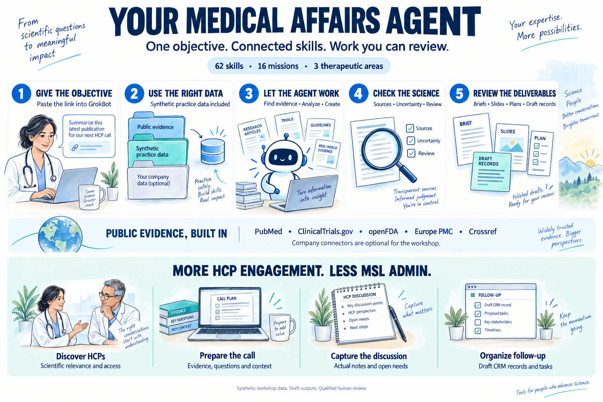

# Medical Affairs Agent Skills

**Give your agent a Medical Affairs objective. Get a traceable draft you can review.**

62 skills · 16 workshop missions · 3 therapeutic areas · public scientific APIs · synthetic data included



## Start here. No coding required.

Open the workshop **GrokBot**, copy the prompt below, and let it work:

```text
Use https://github.com/Open-Medical-Affairs/Medical-Affairs-Skills
Read AGENTS.md and start a workshop mission using the bundled synthetic data.
Begin with oncology field insights unless I choose another area.
Find the three things leadership should know, explain why they matter,
and create a concise leadership brief with source records and next actions.
Use available public APIs only when useful, keeping real evidence separate
from fictional workshop facts. Do not ask me to connect company systems.
If you cannot retrieve the repository, tell me which starter file to upload.
```

**That is the first exercise.** You do not need a GitHub account, company data,
Veeva, Salesforce, SharePoint, or an API key to use the synthetic materials.
You do need a working agent that can read the repository or an uploaded starter.
Internet enables live evidence retrieval. Your agent service may have its own costs.

**Cannot open GitHub from your agent?** Download and upload a self-contained starter:
[Oncology](workshop/bundles/first-mission-oncology-mm.md) ·
[Immunology](workshop/bundles/first-mission-immunology-ad.md) ·
[Cardiometabolic](workshop/bundles/first-mission-cardiometabolic-obesity.md).
On the file page use **Download raw file**. For everything, use **Code → Download ZIP**.

> **Agent reading this?** Start with [AGENTS.md](AGENTS.md). Select the relevant
> skills and inputs; do not load the entire repository into context.

## Choose what you want to accomplish

| Say this to your agent | What it can prepare |
|---|---|
| “Tell leadership what the field is telling us.” | Insight report, source records, priority actions |
| “Prepare me for this difficult KOL meeting.” | Expert brief, scientific questions, unresolved evidence |
| “What changed after congress?” | Readout, evidence limitations, implications for the plan |
| “Work through this medical enquiry queue.” | Triage, draft responses, gaps and simulated safety routing |
| “Which evidence projects should we fund?” | Prioritized portfolio, budget trade-offs, dependencies |
| “Turn this study into consistent scientific materials.” | Manuscript draft, abstract, figure and plain-language summary |
| “Prepare an advisory board around unanswered questions.” | Charter, questions, advisor briefs and pre-read |
| “Are we ready for launch?” | Gate assessment, unresolved dependencies and remediation plan |
| “Use the practice CRM to plan field coverage.” | Account priorities and a feasible field plan |
| “Update content across our medical channels.” | Asset review queue, channel plan, evidence-change impact |
| “Build patient input into our evidence priorities.” | Accessible engagement plan and feedback-to-decision table |
| “Run the next 30 days of Medical Affairs.” | Coordinated plan, brief, tracker and scientific materials |

Use your own task too. The agent routes and combines skills. If a task needs missing
data, a tool or a human decision, it should name that gap and finish the supported work.
This is broad workflow coverage, not a guarantee that every task can be automated.

## How it works

1. **You give the objective.** No skill names or technical prompt required.
2. **The agent selects the inputs.** Synthetic packs for workshop work; your supplied
   data or authorized connections for actual work.
3. **It retrieves and analyzes.** Public evidence where useful, exact sources,
   appropriate study interpretation and explicit gaps.
4. **It checks the draft.** Challenges claims, reconciles numbers and preserves
   material limitations and safety findings.
5. **You review the result.** Files where supported, sources, next actions and
   remaining decisions. Professional approval stays with accountable people.

## No company connectors? Start anyway.

| What is available | What happens |
|---|---|
| Synthetic pack only | The agent completes the supported mission with local sources |
| Internet and public APIs | It can add separately labelled real-disease evidence |
| Your authorized company connections | It can use the permitted records and document versions |
| No code execution or file creation | It reads available files and provides structured content in the response |

A public API outage is not an empty search. A missing renderer is not permission
to lose the analysis. The agent states what it could and could not do.

## More HCP engagement. Less MSL administration.

The MSL workflow gathers prior interactions, open commitments, scientific evidence
and access context, then prepares a focused pre-call brief. After the conversation,
it turns supplied notes into draft CRM records, follow-up tasks and scientific gaps.
It can also identify relevant professional profiles and appropriate institutional
access routes, guided by scientific need rather than prescribing value.

**New MSL missions:** pre-call preparation, HCP discovery/access, post-call follow-up
and clearing the administrative queue. The practice organization includes **90 access
records and 180 task records**. Actual outreach and CRM updates need authorized tools.

[MSL workflow and starter prompt](docs/msl-workflow.md)

## Public scientific tools are included

**PubMed, ClinicalTrials.gov, openFDA, Europe PMC and Crossref** have executable
search/retrieval routes. Citation checking resolves identifiers and supports a
separate source-to-claim review. Core public routes need no key at basic limits.
OpenAlex is an optional verification fallback, with access requirements checked at use.

**Transcription:** supplied transcripts work immediately. Native audio tools or
optional local Whisper can process recordings where the environment supports them.
Local Whisper is free software; a hosted transcription service is not assumed free.

The agent can run these from a Python-capable environment:

```bash
python3 scripts/workshop.py check --live
python3 scripts/public_evidence.py pubmed --query 'multiple myeloma' --limit 5
```

[API setup and limitations](docs/api-setup.md) · [Audio/transcription](docs/transcription.md)

## A fictional organization you can actually work with

The oncology, immunology and cardiometabolic packs contain **32 source files each**:
profiles, field notes, enquiries, trial summaries, congress abstracts, manuscripts,
budgets, study concepts, readiness trackers, review comments and more.

The connected practice organization adds **24 accounts, 90 clinicians, 163 field
interactions, 18 enquiries, 36 content assets, 90 engagement records, 12 patient
partnership records and 18 projects**, plus a data dictionary and source registry.
Use its CSV files or the included SQLite database. No server or login is needed.

All products, people and clinical results in these packs are fictional. Their
inconsistencies are deliberate exercises in judgment. Real bibliographic examples
are stored [separately](workshop/public-evidence/README.md), never as evidence for
fictional product claims.

[Practice organization](workshop/data/connected/README.md) ·
[Original skill coverage](workshop/data/SKILL-COVERAGE.md) ·
[Complete mission and input catalog](workshop/catalog.json)

## The October workshop

Start with a small win, improve it with a local rule, then tackle a larger objective.
The capstone asks the agent to plan the next 30 days. Halfway through, the facilitator
introduces changed evidence, a budget cut or a new constraint. The agent must identify
and update the affected work, with a visible change log.

[Participant quickstart](workshop/PARTICIPANT-QUICKSTART.md) ·
[Two-hour facilitator runbook](workshop/OCTOBER-RUNBOOK.md) ·
[Change cards](workshop/change-cards/README.md) · [Scorecard](workshop/scorecard.md)

[Readiness checks and remaining rehearsal steps](docs/validation.md)

## Bring it to work later

Use the [connection guide](docs/connections.md) for Veeva Vault CRM, Veeva CRM on
Salesforce, other Vault applications, Salesforce, SharePoint and local databases.
The agent first checks what is actually connected, then asks for the specific
missing access or an approved export. Tenant permissions are never bundled here.

Customize `house-rules/<skill-name>.md` in your own workspace. Private SOPs and
company records stay private. Seeded examples are not active company policy.
See [agent setup](docs/agents.md) and [execution behavior](docs/execution.md).

## What the files can look like

The [synthetic advisory-board example](examples/advisory-board-deck/) demonstrates
the shared visual style, clinical figures and deck generator. Available formats
include presentations, documents, spreadsheets, PDFs and interactive HTML.
Actual formats depend on the agent environment; supported content remains available
when a preferred renderer is missing.

[All 62 skills](SKILLS-INDEX.md) · [Capability menu](assets/menu-card.svg)

## Open to use. Official changes controlled by the maintainers.

**Apache-2.0.** The industry can use and adapt these skills. Forks do not grant
write access to this official repository. Contributions come through pull requests;
`@vivmuk` is the default code owner. Enforced review also requires the owner to
activate GitHub branch rules. [Governance setup and current verification limits](docs/repository-governance.md).

[Contributing](CONTRIBUTING.md) · [License](LICENSE) · [Attribution](THIRD-PARTY-NOTICES.md)

## Review before real use

Outputs are drafts requiring qualified review. This is not a clinical decision
system, validated GxP platform or pharmacovigilance reporting system. Workshop
safety cases are simulated; real cases follow your actual reporting procedures.
See [DISCLAIMER.md](DISCLAIMER.md). Do not upload real company or patient data into
the workshop environment.
